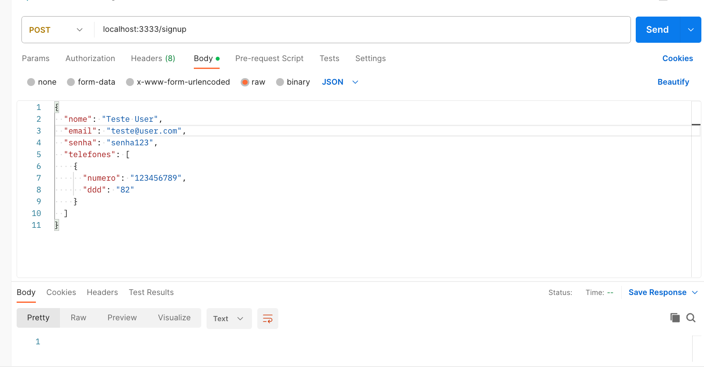
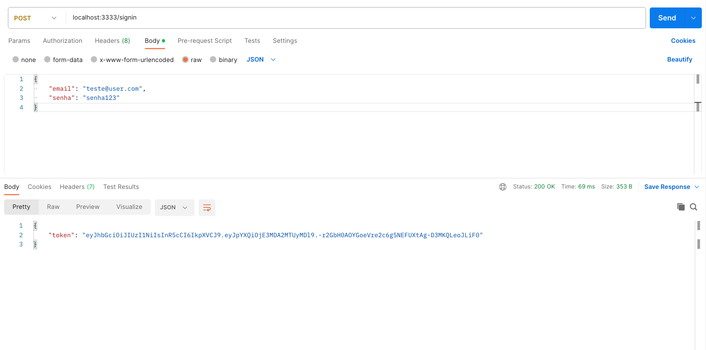

# API REST
## 

### Como usar:
- Clone o projeto
```bash
git clone https://github.com/thiagoleites/aprest.git
```

- Instalar as dependências
```bash
npm install
```
- Definir o arquivo .env para porta da aplicação seguindo o exemplo do arquivo env-example (Obs: Se o mesmo não for definido, por padrão a aplicação será executada na porta 3000)

## Adicionar usuário

<code>rota /signup</code>



## Logar com usuário

<code> rota /signin</code>

