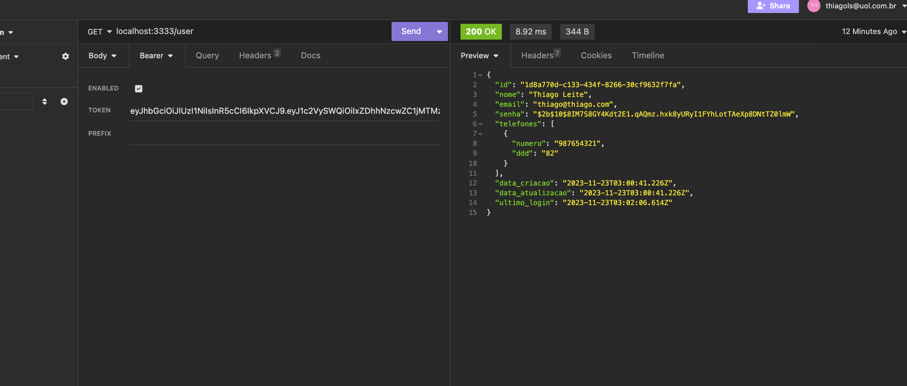

# API REST
## 

### Como usar:
- Clone o projeto
```bash
git clone https://github.com/thiagoleites/aprest.git
```

- Instalar as dependências
```bash
npm install
```
- Definir o arquivo .env com as variavéis para porta da aplicação seguindo o exemplo do arquivo env-example (Obs: Se o mesmo não for definido, por padrão a aplicação será executada na porta 3000) bem como a TOKEN_SECRET usada para autenticação JWT.

<br><br>
<hr>

# Segue alguns exemplos do funcionamento da API 
## Adicionar usuário

<code>rota /signup</code>


## Logar com usuário

<code> rota /signin</code>


## Info do usuário

<code> rota /user</code>

